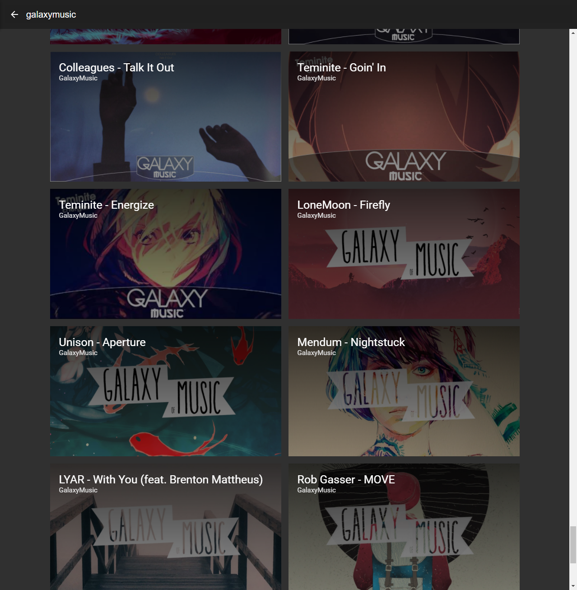

# Sana
Sana was a YouTube and SoundCloud archival service which archived targeted content
between late 2015, and late 2016.

It hosted a front-end which was available at [sana.6f.io](https://sana.6f.io)
(no longer available). The front-end provided a list of recently uploaded
content, a full-text search and a media player, which incorporated an audio
spectrum (a primitive form of [spectrum](https://github.com/uhthomas/spectrum).

The service was decommissioned after a year due to excessive storage use. The
final nail in the coffin being a corrupt MongoDB database which lost all
metadata permanently, due to an unexpected power supply interrupt.

Any API keys or tokens present in the source code are now invalidated.

This repository serves as an archive for the final state of the project.
The original, untouched source can be found on the [archive branch](https://github.com/uhthomas/sana/tree/archive).

## Dependencies
* [MongoDB](#mongodb)
* [Elastic Search](#elastic-search)
* YouTube Data API v3

### MongoDB
MongoDB was the database driver for Sana. There was no reason for this decision
other than ease of use, and learning. At the end of the service's life, MongoDB
showed its thorns. See earlier section where it is described that a power outage
corrupted the database.

### Elastic Search
Sana initially used [Algolia](https://www.algolia.com/), but quickly hit the
limits of the free tier. According to
[archive.org](https://web.archive.org/web/20160624123354/https://www.algolia.com/pricing)
this would have been 10,000 records.

Once the quota was exceeded, a new Elastic Search cluster was provisioned to
handle search queries. Metadata was inserted in the same breath as the database.

## Statistics
It's hard to get firm numbers, as the database which had all of this information
is gone. All that remains are the videos, along with their BSON ID, and the
accompanying thumbnails.

According to this limited data set, the following can be deduced:
* Active between `2015-12-02 22:21:28 +0000 UTC` and `2016-11-13 06:48:56 +0000 UTC`
* 28,239 thumbnails (2.80GB)
* 95,016 videos (3.50TB, before [pruning](#pruning))
* 28,058 videos (1.32TB, after [pruning](#pruning))

There's a DB query which was executed and archived `2016-11-15`, which states
there were **28,233** records before decommissioning.
```sh
> use sana
switched to db sana
> db.media.find({}).length()
28233
>
```

### Pruning

Near the end of its life, it looks as if there was a bug where it would download
the same video repeatedly as a new record. A naive content duplication detector
finds roughly **66,958** videos were erroneously created.
```sh
$ jq 'map(select(length > 2)) | add | length' < out.json
66958
```
Further breakdown shows the buckets they fall into. Each number is a naive guess
at how many duplicate videos there are.
```sh
$ jq 'map(length) | unique' < out.json
[
  1,
  2,
  3,
  4,
  17,
  19,
  24,
  74,
  154,
  239,
  252,
  273,
  634,
  1011,
  5655,
  13826,
  13928,
  14565,
  15012
]
```

## Sources
The content was collected from the following sources;
| Channel name        | Channel ID                         |
| ------------------- | ---------------------------------- |
| Affinity            | UUOJEt1dxJYH1N6jnLfB6SeA           |
| AngelicBunny        | UUu5NDvqE639JOxpqlK7UKUA           |
| Artzie Music        | UU6hBefyLMtG7FXhZ55da3Vw           |
| AvienCloud          | UUKioNqOX_kOCLcSIWPL_lxQ           |
| CloudKid            | UUSa8IUd1uEjlREMa21I3ZPQ           |
| DiscoFactory        | UU_xBnI4WIyYyKw6yJjHsCdA           |
| DiscoThrill Records | UU3e96kvQtQD9IT0pAqMGj5w           |
| Diversity           | UU7tD6Ifrwbiy-BoaAHEinmQ           |
| EDMSoundEater       | UUCfBdlrFOv3_PBc5SFUE4-Q           |
| Electronic Gems     | UUPzWlhG7QM56Y8MYB3qMVnQ           |
| ElFamosoDemon       | UURUOfuNIb_sk__7snjK3aVg           |
| ENM                 | PLcghjaDFUHgkFttlesFQ06nhgoXQkS1SI |
| ENM RE              | UUkwpDBMwfr6ETIm66sPxZ-w           |
| EvolveMusicNetwork  | UU87ARwwcHUbd1WPaz11zw4g           |
| FunkyPanda          | UUUHhoftNnYfmFp1jvSavB-Q           |
| Future Classic      | UUy3DbVl0K1qj0e8jGAOYgPg           |
| FutureHype          | PLDXNpKa6EPd1hElb15HOiHUBj-Pek3lg1 |
| GalaxyMusic         | UUIKF1msqN7lW9gplsifOPkQ           |
| GalaxyMusicNet      | UUbfMTDftQhRySQKFCV8PfHg           |
| HyperboltEDM        | UUF6-fdubXkcpELOB5sUbrWw           |
| Kyra                | UUqolymr8zonJzC08v2wXNrQ           |
| Liquicity           | UUSXm6c-n6lsjtyjvdD0bFVw           |
| MA Dance            | UUF8QEPMImbbJD_s0IHCBNRw           |
| MA Lite             | UUlFjOLis3eUKAGkCKCwdYxQ           |
| Majestic Casual     | UUXIyz409s7bNWVcM-vjfdVA           |
| majesticdnb         | UUd3qPLVGUGKfWeuUjC0OJWQ           |
| MikuMusic           | UUjw0SX_9OGFI7buLG4-M0Fw           |
| Monstercat          | UUJ6td3C9QlPO9O_J5dF4ZzA           |
| MOR Network         | UUkfMJApxxdy-h41xy_8AHNw           |
| MORindie            | UUcTvjjmFeFDd5Ri5NajGImA           |
| MOΣDM               | UU_dBZzj82blh0hp_w6nxrDA           |
| MrSuicideSheep      | UU5nc_ZtjKW1htCVZVRxlQAQ           |
| NeurofunkGrid       | UU1hPZ15rCXacep76EgDfwyw           |
| NoCopyrightSounds   | UU_aEa8K-EOJ3D6gOs7HcyNg           |
| OneChilledPanda     | UUkUTBwZKwA9ojYqzj6VRlMQ           |
| Paradoxium          | PLeeznYF7ppjfH3JetE0AocdA0dI3r3fFg |
| Pixl Networks       | UU1iqebKNH36JIdBIjEy8-iQ           |
| Real ℒℴѵℯ ❤         | UU8EvY5Cky6LM9tTE07kk2kQ           |
| Selected.           | PLSr_oFUba1jtP9x5ZFs5Y0GJkb8fmC161 |
| Self                | LLahIftu-BClclAu0uPLewGQ           |
| Strobe Music        | UUcoYD5HDg8P-gvJU-oDYq5Q           |
| Synergy Music       | UUrbRMQk4-CnFZLmLuz0KyHQ           |
| SyrebralVibes       | UUi0LydWaEUy3Vx8flL29ebQ           |
| TriangleMusic       | UUDBdeEaSnlu-AU-ITBTRkeQ           |
| TriDanceMusic       | UU1qAm032wFDxwR2a3WSeV0w           |
| Waifu Wednesdays    | PU-wNjNTqCfXSKd4S1tNgWUg           |
| Welcome Home Music  | UUGBI6hbiJWpRs00cANGlx2w           |
| xKito Music         | UUMOgdURr7d8pOVlc-alkfRg           |

## Hardware
Sana ran on a dedicated Arch Linux server, a Dell R720 equipped with an Intel
Xeon E5-2630 v2 (6C12T) and 16GB ECC memory.

The storage server ran Windows Server 2012 R2 with an Intel Xeon E5-2609 v2 (4C4T),
with 32GB ECC memory. It ran a storage pool consisting of 4 x 4TB drives. Sana
was allocated 4TB of the pool. The two servers were linked across a 2Gbe interconnect.


## Screenshots

### Recent


### Search

